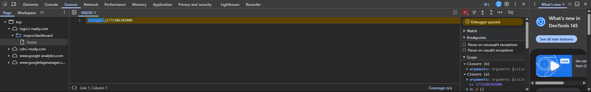

# How to allow DevTools on websites that block it.
### First, open up DevTools and go to the "Sources" tab. Then, click on the arrow with a cross icon.

### Now,  click on the triangle icon.

### You're done!
